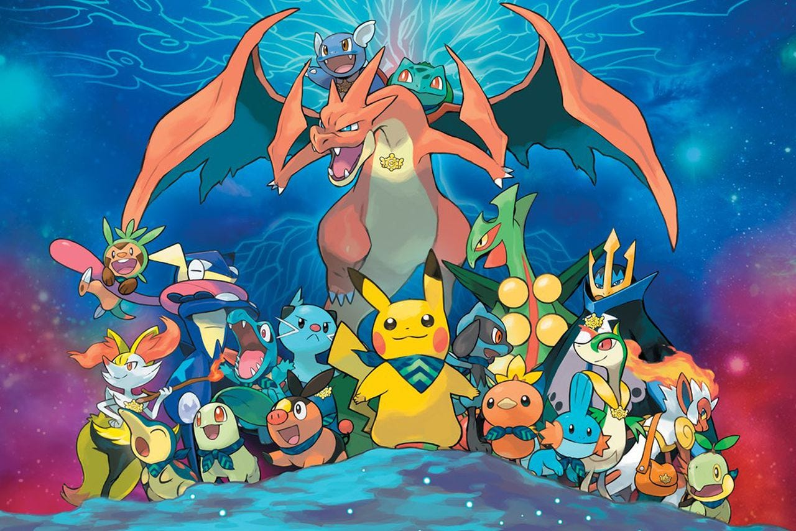

# POKEMABUONI TEAM

# FDS 2025 - Pokémon Battle Prediction
Team composition: Giuseppe Stillitano, Edoardo Besteghi, Riccardo Bucchi

This repository contains the source code for the FDS Pokémon Battles Prediction 2025 Kaggle competition.

The goal is to predict the winner of a Pokémon battle (Player 1 vs. Player 2) given the timeline data from the first 30 turns.

##  Approach

The associated Kaggle notebook clones this repository and runs a complete feature engineering and modeling pipeline.

### 1. Feature Engineering

The sequential timeline data (`battle_timeline`) is flattened into a static feature set (43 features) for each battle. These features are generated by the functions in `feature_pipeline.py`.

* **Strategic (T0) Features:** Team-wide average win rates, meta scores, and base stat advantages (e.g., `p1_base_spe_advantage`).
* **Tactical (T1-T30) Features:** Cumulative damage (`hp_delta_balance`), status (`status_balance`), switches (`switch_advantage`), and boost move counts.
* **Moveset (T1-T30) Features:** Counts of how often a player used "meta" moves (e.g., `META_STATUS_MOVES`, `META_BOOST_MOVES`).
* **Endgame (T30) Features:** A final snapshot including remaining Pokémon (`remaining_pokemon_advantage`), total HP (`total_hp_advantage`), and a type advantage score (`t30_type_advantage`).

### 2. Modeling

The final notebook trains three distinct models for submission, as required by the competition rules.

1.  **Model 1 (Baseline):** A `LogisticRegression` model with an Elastic Net penalty, tuned with `GridSearchCV`.
2.  **Model 2 (Stacking):** A "Mixture of Experts" model. It trains three Level 1 "experts" (LR, SVM, XGBoost) and then calibrates their outputs. A Level 2 "manager" (`LogisticRegression`) is trained on these calibrated probabilities to learn the optimal weights and make the final prediction.
3.  **Model 3 (Voting):** A `VotingClassifier` that takes a weighted average (`voting='soft'`) of the probabilities from three calibrated experts (LR, SVM, LightGBM).

##  Repository Structure

* **`constants.py`**:
    Contains all global constants.

* **`helpers.py`**:
    Contains all pre-processing functions (e.g., `type_map`, `pokemon_win_rate`, `build_observed_moveset_map`) and various helper functions (e.g., `get_fainted_counts`, `get_type_multiplier`).

* **`feature_pipeline.py`**:
    Contains all core feature engineering functions (e.g., `process_battle_base`, `compute_tactical_features`, `compute_endgame_features`) and the main `create_dataset` function that guides the pipeline.

* **`model_pipeline.py`**:
    Contains the three high-level functions (`run_model_1_...`, `run_model_2_...`, `run_model_3_...`) that define, train, and evaluate the final submission models.
